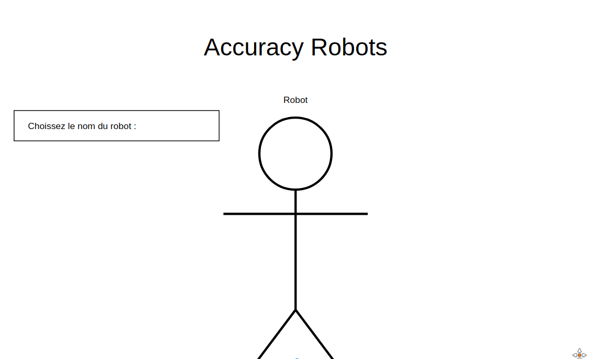
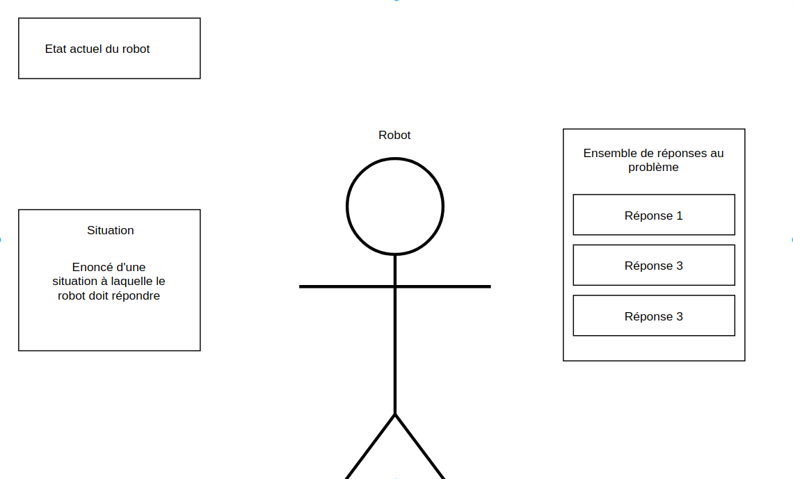

# Projet T4 : Accuracy Robots

**Étudiants** : *Thomas Eyermann, Maxime Princelle, Quentin Schaeffer, Jean-Thavorak Phe*

## Partie théorique

### Objectif pédagogique général

Mettre en oeuvre les lois d’Asimov au travers d’un jeu de choix.
Les choix que le joueur va prendre prendre lors du jeu, pourront parfois l'amener à un paradoxe mais cela va également lui permettre de faire comprendre la difficulté que représente le fait de créer des lois pour encadrer l’IA.

### Description du jeu
**Type de jeu** :  Décisionnel - choix tour par tour   
**Incarnation du joueur** : Le joueur incarne un robot  

**Contexte** :  
L’histoire se déroule en l’an 5347 après la colonisation de Mars. Celle-ci est devenue une planète où les robots et les humains vivent en parfaite harmonie. Différents types de robots ont étés conçus durant ces dernières années tels que des robots militaires ou des robots secouristes.

Les robots sont conçus selon des lois biens spécifiques : les lois d’Asimov.
Ces lois sont axées autour de trois axes principaux :

- Un robot ne peut blesser un être humain ni, par son inaction, permettre qu'un humain soit blessé.

- Un robot doit obéir aux ordres donnés par les êtres humains, sauf si de tels ordres sont en contradiction avec la Première Loi.

- Un robot doit protéger sa propre existence aussi longtemps qu'une telle protection n'est pas en contradiction avec la Première et/ou la Deuxième Loi.

Mais par la suite une loi Zéro à fait irruption : “Un robot ne peut nuire à l’humanité ni laisser sans assistance l’humanité en danger.”

Accuracy, une entreprise conceptrice de robots, est en train de développer un nouveau type de robots, plus performants.
Leur politique se base sur le fait de tester les différents robots qu’ils conçoivent afin de trouver quel modèle de robot correspondra le mieux à leur attentes pour une production future.

Vous incarnez un robot fraîchement sorti de la production d’Accuracy et vous allez maintenant devoir passer les tests imposés par vos créateurs pour savoir si vous correspondez à leurs attentes.

Le test est le suivant : vous devrez faire des choix en fonction de différentes situations qui se présenteront à vous. Ces choix seront parfois évident mais parfois plus compliqués et votre but sera de faire les meilleurs choix pour répondre le mieux possible aux lois d’Asimov.

Attention, un robot ne peut enfreindre aucune loi d’Asimov, s’il les enfreint son bon fonctionnement sera compromis et finira par s'autodétruire pour ne pas mettre en danger la race humaine...

### Déroulement d’une partie
Le joueur commence par choisir son robot (qu’il pourra personnaliser par la suite).  

Par la suite, les différentes étapes seront :
* Affichage d’une situation quelconque  
* Choix du robot par rapport à la situation  
* Affichage de la conséquence de son choix  
* Passage à la situation suivante  
* Paramétrage d’une partie  
* Nombre de tours : nombre de tours de jeu (chaque tour correspondant à une situation)  
Nom du robot

## Partie conception

### Interface schématisée du jeu

Avant la conception même du jeu nous avons décidé de schématiser l'interface pour savoir à quoi allait ressembler ce dernier.

#### Ecran d'accueil
Ecran permettant la personnalisation de son personnage avant une partie.

#### Ecran de jeu
Une partie sera intégralement jouée sur l'écran suivant affichant différents choix et conséquences durant le déroulement de la partie.

